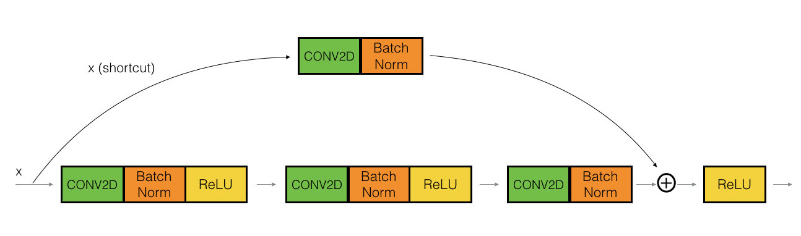

# ResNet-50-model
Deep Residual Learning for Image Recognition

Implementing a deep neural network using Residual Networks based on the research paper [Deep Residual Learning for Image Recognition](https://arxiv.org/abs/1512.03385).

## Model Architecture:

CONV2D -> BATCHNORM -> RELU -> MAXPOOL -> CONVBLOCK -> IDBLOCK*2 -> CONVBLOCK -> IDBLOCK*3
    -> CONVBLOCK -> IDBLOCK*5 -> CONVBLOCK -> IDBLOCK*2 -> AVGPOOL -> TOPLAYER

### Resnet Blocks structure:

The images for the architecture are obtained from this [blog](https://towardsdatascience.com/understanding-and-coding-a-resnet-in-keras-446d7ff84d33).

1. Identity Block:

2. Convolutional Block:

## Output Accuracy:

The model was trained using Google colab platform for 20 epochs. The following is the output,

120/120 [==============================] - 1s 6ms/sample - loss: 0.2791 - accuracy: 0.9250
Loss = 0.2790559738874435
Test Accuracy = 0.925

The model has an accuracy of 92.5%

The model structure can be viewed [here](). 

## Model Summary:

- Total params: 23,600,006
- Trainable params: 23,546,886
- Non-trainable params: 53,120

## Reference:

1. [Deep Residual Learning for Image Recognition](https://arxiv.org/abs/1512.03385)
2. Francois Chollet's GitHub repository : https://github.com/fchollet/deep-learning-models/blob/master/resnet50.py

	

